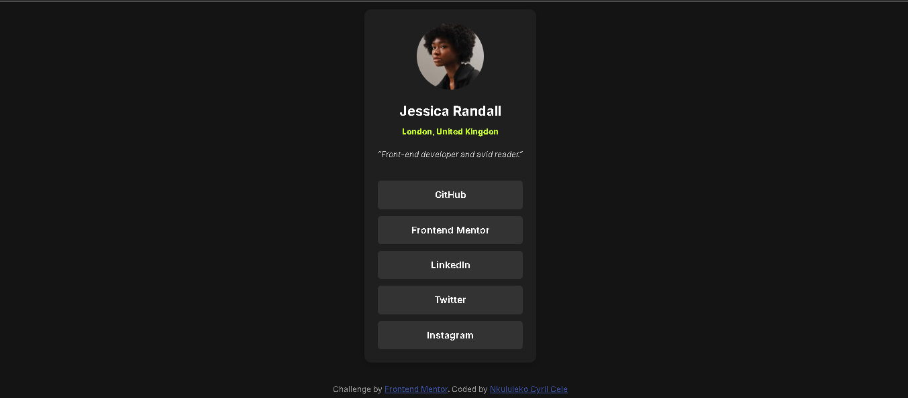

# Frontend Mentor - Social links profile solution

This is a solution to the [Social links profile challenge on Frontend Mentor](https://www.frontendmentor.io/challenges/social-links-profile-UG32l9m6dQ). Frontend Mentor challenges help you improve your coding skills by building realistic projects. 

## Table of contents

- [Overview](#overview)
  - [The challenge](#the-challenge)
  - [Screenshot](#screenshot)
  - [Links](#links)
- [My process](#my-process)
  - [Built with](#built-with)
  - [What I learned](#what-i-learned)
  - [Continued development](#continued-development)
  - [Useful resources](#useful-resources)
- [Author](#author)
- [Acknowledgments](#acknowledgments)

**Note: Delete this note and update the table of contents based on what sections you keep.**

## Overview

### The challenge

Users should be able to:

- See hover and focus states for all interactive elements on the page

### Screenshot



### Links

- Solution URL: [GitHub repository](https://github.com/NkululekoCyrilCele/social-links-profile)
- Live Site URL: [Click here](https://nkululekocyrilcele.github.io/social-links-profile/)

## My process

### Built with

- Semantic HTML5 markup
- CSS custom properties
- Flexbox
- Mobile-first workflow
- [Inter](https://fonts.google.com/specimen/Inter) - Font Family

### What I learned

During this project, I reinforced my understanding of:

- Using semantic HTML to improve accessibility and SEO.
- Applying Flexbox to create responsive layouts that adapt to different screen sizes.
- Implementing a mobile-first design approach to ensure usability across devices.

Example of semantic HTML:

```html
<main class="profile-card">
    <header class="profile-card__header">
        
        <h1 class="profile-card__name">John Doe</h1>
        <p class="profile-card__location">Location: Somewhere</p>
    </header>
    <p class="profile-card__bio">This is a brief bio about John Doe.</p>
</main>
```

Example of CSS using BEM methodology:

```css
.profile-card__links {
    display: grid;
    gap: 1rem;
}
```

### Continued development

In future projects, I aim to:

- Further explore CSS Grid for more complex layouts.
- Enhance my knowledge of accessibility standards to ensure my designs cater to all users.
- Continue improving my skills with responsive design techniques to provide the best user experience.

### Useful resources

- [Frontend Mentor Community](https://www.frontendmentor.io/community) - TGreat for feedback and inspiration.
- [CSS Tricks - Flexbox Guide](https://css-tricks.com/snippets/css/a-guide-to-flexbox/) - A helpful reference for mastering Flexbox.

## Author

- Nkululeko Cyril Cele
- Frontend Mentor - [@NkululekoCyrilCele](https://www.frontendmentor.io/profile/NkululekoCyrilCele)
- X - [@NkululekoCyril5](https://x.com/NkululekoCyril5)
- Threads [@nkululekocyrilcele](https://www.threads.net/@nkululekocyrilcele)
- LinkedIn [@NkululekoCyrilCele](https://www.linkedin.com/in/nkululeko-cele-9b811821a/)
- Facebook [@nkululekocyrilcele](https://www.facebook.com/nkululekocyrilcele/)

## Acknowledgments

A special thanks to the Frontend Mentor community for their feedback and support throughout this project. Their insights have greatly improved my work.